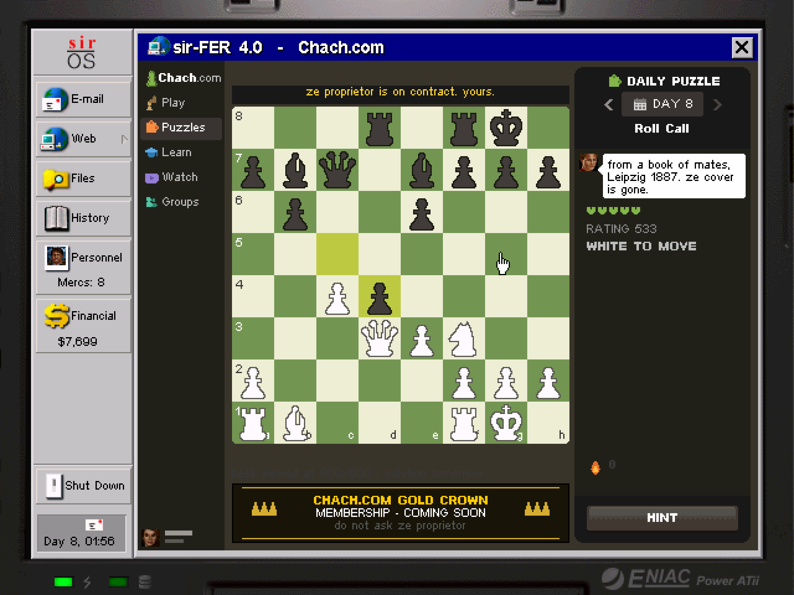

# ja2-stracciatella-www

*Arulco has an internet. This is a project to fill it in.*

Built on [JA2 Stracciatella](https://github.com/ja2-stracciatella/ja2-stracciatella).

<p align="center">
  
  
</p>

## The angle

Jagged Alliance 2 hands you a laptop with a working web browser, and in 1999
that was the joke and the worldbuilding at once: you hire soldiers off a
website, order rifles from a catalogue, read a flower shop's condolence
options, and buy life insurance from a man who should clearly not be selling
it. The sites are terrible in exactly the way real 1999 sites were terrible —
hit counters, guestbooks, "best viewed in" badges, unearned confidence — and
that is what makes Arulco feel like a country with a modem in it.

The vanilla browser has about a dozen bookmarks and then stops. **This repo
treats that browser as a platform.** Every site added here is a real,
interactive page inside the game: written in-universe, wired into the
campaign, and dressed in period-correct bad web design. Not menus with a
skin — pages that email you, remember you, take your money, and have
opinions about how you play.

Anything Arulco's population would plausibly have put online is fair game.
Some of it is a game you play, some of it is a place you read. The point is
that the browser stops being a handful of dead links and starts being an
ecosystem.

## What's online

| Site | Status | |
|---|---|---|
| **San Mona Mahjong Parlour** — a gambling establishment, and its regulars | live | [details ›](docs/sites/mahjong.md) |
| **Chach.com** — one merc's chess site, daily puzzle and all | live | [details ›](docs/sites/chach.md) |
| A dating site | planned | |

Each site's page documents it in full. **Those pages contain spoilers** — how
you find it, who you meet, what it costs. The sites are written to introduce
themselves in game, so play first if you would rather be surprised.

## Playing

You need the original Jagged Alliance 2 game data (any retail/GOG copy). On macOS:

```sh
brew install cmake googletest fltk
mkdir _bin && cd _bin
cmake -DCMAKE_TOOLCHAIN_FILE=../cmake/toolchain-macos.cmake -DBUILD_LAUNCHER=OFF ..
make -j$(sysctl -n hw.ncpu)
./ja2 -unittests
./ja2
```

Point `~/.ja2/ja2.json`'s `game_dir` at your JA2 installation. For other
platforms, follow upstream's [COMPILATION.md](COMPILATION.md).

Then open the laptop and read your mail. The sites find you.

## Building a site

The recipe is the same each time: a `LAPTOP_MODE_*` entry and a bookmark, a
render/handle pair under `src/game/Laptop/`, strings across the nine
translation files, an email that introduces the site, and art generated by
script rather than drawn by hand — so everything rebuilds from source with no
binary assets to misplace. Game logic lives in its own engine-free
translation unit with unit tests, separate from the page that draws it.

## Branches

| branch | what |
|---|---|
| `main` | everything shipped, always playable |
| `site/<name>` | one site under construction |

A site lives on its own branch until it is finished, then lands on `main`.

## Credits & license

Built on [JA2 Stracciatella](https://github.com/ja2-stracciatella/ja2-stracciatella)
— all credit for the port, engine and tooling belongs to that project and its
contributors. This fork's additions follow the same terms as upstream:
changes are released to the public domain; the original Jagged Alliance 2
source was released by Strategy First Inc. in 2004 under the SFI Source Code
License Agreement (see *SFI Source Code license agreement.txt*). Jagged
Alliance 2 and its characters are the property of their respective rights
holders; this is an unofficial fan project and requires an original copy of
the game.
