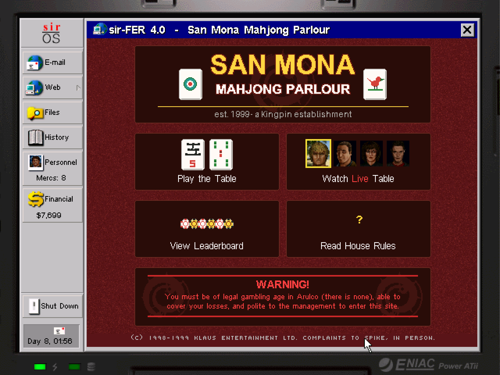

# ja2-stracciatella-www

*Arulco has an internet. This is a project to fill it in.*

Built on [JA2 Stracciatella](https://github.com/ja2-stracciatella/ja2-stracciatella).

<p align="center">
  
</p>

<p align="center"><sub>The San Mona Mahjong Parlour, open in the laptop's browser on day 8.</sub></p>

## The angle

Jagged Alliance 2 hands you a laptop with a working web browser, and in 1999
that was the joke and the worldbuilding at once: you hire soldiers off a
website, order rifles from a catalogue, read a flower shop's condolence
options, and buy life insurance from a man who should clearly not be selling
it. The sites are terrible in exactly the way real 1999 sites were terrible —
hit counters, guestbooks, "best viewed in" badges, unearned confidence — and
that is what makes Arulco feel like a country with a modem in it.

The vanilla browser has about a dozen bookmarks and then stops. **This repo
treats that browser as a platform.** Every site added here is a real,
interactive page inside the game: written in-universe, wired into the
campaign, and dressed in period-correct bad web design. Not menus with a
skin — pages that email you, remember you, take your money, and have
opinions about how you play.

Anything Arulco's population would plausibly have put online is fair game.
Some of it is a game you play, some of it is a place you read. The point is
that the browser stops being a handful of dead links and starts being an
ecosystem.

## What's online

### San Mona Mahjong Parlour ✅

A fully playable Sichuan mahjong room run by mob boss Peter "Kingpin" Klaus,
where you face Enrico, Deidranna and Elliot for real campaign money.

> est. 1999 — a Kingpin establishment. Games are fair because Mr. Klaus says so.

**The game.** Full Sichuan rules (血战到底, bloody to the end): 108 suit tiles,
the three-tile exchange, a declared void suit, pong and kong with replacement
draws, robbing the kong, fan scoring with roots, kong bonuses, and tenpai and
flower-pig settlements — winners retire and the hand fights on until three
stand or the wall dies. The rules core is engine-free, deterministic by seed
and unit-tested; the opponents have distinct skill levels, error rates and a
grudge model.

**The world.** A $250 buy-in settled through the Finances screen at 20 points
to the dollar, a 10% house rake, Kingpin loans at 20% vig, and a
triple-stakes invitational every seventh day. Kingpin wires your winnings and
collects your debts by email. The cast rotates with the campaign calendar,
the chatter tracks how your war is going, and characters speak in their own
mined voice samples.

**The 1999 of it all.** An AIM-style home page, a Yahoo-style ratings ladder
(with one player permanently banned), paged house rules signed by the
proprietor, a guestbook, a hit counter, and a chat client that behaves like
one: people type before they speak, take pauses, say "brb" and actually
leave, occasionally type something and never send it, and get muted by the
room's moderator if you flood it. When nobody is seated, the House plays an
exhibition you can watch.

### Under construction

- **A dating site.** Arulco is full of lonely, heavily armed people.
- **A chess puzzle page.** Somebody's shareware, badly monetised.

## Branches

| branch | what |
|---|---|
| `main` | everything shipped, always playable |
| `site/<name>` | one site under construction |

A site lives on its own branch until it is finished, then lands on `main`.

## Building

You need the original Jagged Alliance 2 game data (any retail/GOG copy). On macOS:

```sh
brew install cmake googletest fltk
mkdir _bin && cd _bin
cmake -DCMAKE_TOOLCHAIN_FILE=../cmake/toolchain-macos.cmake -DBUILD_LAUNCHER=OFF ..
make -j$(sysctl -n hw.ncpu)
./ja2 -unittests   # 154 tests
./ja2
```

Point `~/.ja2/ja2.json`'s `game_dir` at your JA2 installation. For other
platforms, follow upstream's [COMPILATION.md](COMPILATION.md).

In game: open the laptop, read your mail, and wait for the Parlour to find
you. It will.

## How a site is built

| Where | What |
|---|---|
| `src/game/Laptop/Mahjong.{h,cc}` | the site itself: pages, chat, layout, input |
| `src/game/Laptop/MahjongGame.{h,cc}` | engine-free game rules, no JA2 headers |
| `src/game/Laptop/MahjongGame_unittest.cc` | gtest coverage for those rules |
| `docs/custom_artworks_source/laptop/generate_mahjong_tiles.py` | generates every art asset as indexed STI |
| `src/game/Laptop/{Laptop,EMail}.*`, `src/game/Strategic/Game_Event_Hook.*` | registration, discovery mail, delayed events, save persistence |

The recipe is the same for each new site: a `LAPTOP_MODE_*` entry and
bookmark, a render/handle pair, strings across the nine translation files, an
email that introduces it, and art generated by script rather than drawn by
hand — so the whole thing rebuilds from source with no binary assets to
misplace.

## Changelog

See [docs/mahjong-changelog.md](docs/mahjong-changelog.md) for what changed
and when. The live page carries its own build number in the corner.

## Credits & license

Built on [JA2 Stracciatella](https://github.com/ja2-stracciatella/ja2-stracciatella)
— all credit for the port, engine and tooling belongs to that project and its
contributors. This fork's additions follow the same terms as upstream:
changes are released to the public domain; the original Jagged Alliance 2
source was released by Strategy First Inc. in 2004 under the SFI Source Code
License Agreement (see *SFI Source Code license agreement.txt*). Jagged
Alliance 2 and its characters are the property of their respective rights
holders; this is an unofficial fan project and requires an original copy of
the game.
